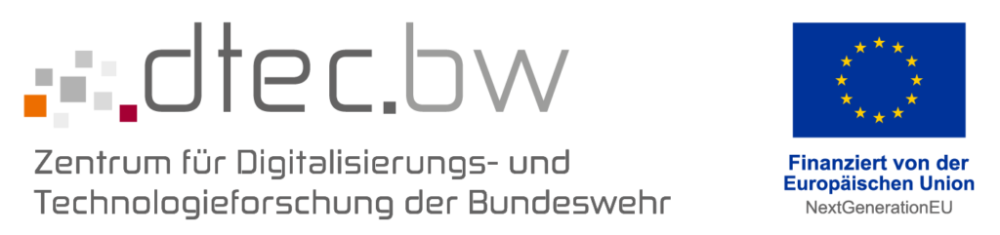

---
#
# By default, content added below the "---" mark will appear in the home page
# between the top bar and the list of recent posts.
# To change the home page layout, edit the _layouts/home.html file.
# See: https://jekyllrb.com/docs/themes/#overriding-theme-defaults
#
layout: home
---

  
  

    <h3>European Trilinos & Kokkos User Group (EuroTUG)Photo: Medienzentrum HSU/UniBwH</h3>
    
HSU/UniBwH, June 24-26, 2024<a href="https://eurotug.hpc.hsu-hh.de/?r=eurotug24" target="_blank">Link to registration</a>

  

## About the Meeting

The _European Trilinos & Kokkos User Group (EuroTUG)_ meeting series offers a platform for Europe-based users and developers
of the [Trilinos Project](https://trilinos.github.io) to

- learn about recent developments in Trilinos,
- report on their use cases and experiences with Trilinos,
- interact with the Trilinos leadership and core developers, and
- form a European network of Trilinos users and developers.

While the annual Trilinos User Group meeting hosted by Sandia National Laboratories (SNL) in Albuquerque, NM, serves as the main community event for Trilinos users, the EuroTUG facilitates easy access to the Trilinos community and reduced travel burdens for Europe-based researchers and application engineers who are interested in the Trilinos project.

For the first time, the workshop also strives to bring together Kokkos users and developers in the same spirit. This will not only foster efforts of the European Kokkos community with regard to scientific computing on heterogeneous hardware, but it will also leverage additional synergies between Trilinos and Kokkos developments.

The *European Trilinos & Kokkos User Group Meeting 2024* will take place on the campus of the [Helmut Schmidt University Hamburg (HSU/UniBwH)](http://www.hsu-hh.de/en/). 

## Registration

In order to participate in the EuroTUG Meeting 2024, please **fill the <a href="https://eurotug.hpc.hsu-hh.de/?r=eurotug24" target="_blank">registration form</a> prior to May 15, 2024**. Registration is required for speakers as well as attendees without a contribution.

The registration is *free of charge*.

If you have any questions or trouble with the registration, feel free to contact us via email at [eurotug@hsu-hh.de](mailto:eurotug@hsu-hh.de).

## Scientific Programme

A detailed schedule will be announced at a later stage.

**Monday, 24. June 2024**

| Time (CEST) | Topic | Speaker |
| ----------- | ----------- | ----------- |
| 10:00 | Begin | |
| 18:00 | End | |

**Tuesday, 25. June 2024**

| Time (CEST) | Type | Topic | Speaker |
| ----------- | ----------- | ----------- | ----------- |
| 08:30 | Begin | |
| 17:30 | End | |
| TBA | Dinner | |

**Wednesday, 26. June 2024**

| Time (CEST) | Type | Topic | Speaker |
| ----------- | ----------- | ----------- | ----------- |
| 09:00 | Begin | | |
| 15:00 | End | | |

## Venue & Accommodation

The *European Trilinos & Kokkos User Group Meeting 2024* will take place at the campus of the [Helmut Schmidt University Hamburg (HSU/UniBwH)](http://www.hsu-hh.de/en/):

&nbsp;&nbsp;&nbsp;&nbsp;&nbsp;&nbsp;Helmut-Schmidt-Universität  
&nbsp;&nbsp;&nbsp;&nbsp;&nbsp;&nbsp;Universität der Bundeswehr Hamburg  
&nbsp;&nbsp;&nbsp;&nbsp;&nbsp;&nbsp;Holstenhofweg 85  
&nbsp;&nbsp;&nbsp;&nbsp;&nbsp;&nbsp;22043 Hamburg  
&nbsp;&nbsp;&nbsp;&nbsp;&nbsp;&nbsp;Germany  

More information will follow. Click <a href="https://www.hsu-hh.de/en/university/directions" target="_blank">here</a> for information on how to get to the HSU/UniBwH.

For accommodation, we recommend the following hotels:

| Hotel                          | Email                                                        | Website                                                | Address                              |
| :----------------------------- | ------------------------------------------------------------ | ------------------------------------------------------ | ------------------------------------ |
| *Select Hotel Tiefenthal* | [tiefenthal@select-hotels.com](mailto:tiefenthal@select-hotels.com) | [select-hotels.com](https://www.select-hotels.com/en/select-hotel-tiefenthal) | Wandsbeker Marktstraße 109, 22041 Hamburg       |
| *the niu Keg \| City-Hotel Hamburg-Ost*    | [info@the.niu.de](mailto:info@the.niu.de)            | [the.niu.de](https://the.niu.de/en/hotels/germany/hamburg/the-niu-keg)         | An der Alster 63, 20099 Hamburg         |
| *Barceló Hamburg*             | [hamburg@barcelo.com](mailto:hamburg@barcelo.com)      | [barcelo.com](https://www.barcelo.com/en-ie/barcelo-hamburg/)     | Ferdinandstrasse 15, 20095 Hamburg         |
| *PIERDREI HOTEL*         | [info@pierdrei-hotel.de](mailto:info@pierdrei-hotel.de)        | [pierdrei-hotel.de](https://www.pierdrei-hotel.de/en/home)  | Am Sandtorkai 46, 20457 Hamburg  |
| *Alster-Hof*             | [info@alster-hof.de](mailto:info@alster-hof.de) | [alster-hof.de](https://www.alster-hof.de/?lang=en)            | Esplanade 12, 20354 Hamburg |

## Organizing Committee

The *European Trilinos & Kokkos User Group Meeting 2024* will be jointly organized by:

- [Dr. Philipp Neumann](https://www.hsu-hh.de/hpc/philipp-neumann/) (HSU/UniBwH)
- [Dr. Matthias Mayr](https://mayrmt.github.io) (University of the Bundeswehr Munich)
- [Dr. Alexander Heinlein](https://searhein.github.io) (TU Delft)

## Acknowledgement

The *European Trilinos & Kokkos User Group Meeting 2024* is funded by the project hpc.bw, funded by dtec.bw — Digitalization and Technology Research Center of the Bundeswehr. dtec.bw is funded by the European Union – NextGenerationEU.

